# 🐹 Token Hamster

A Claude Code mod: a vector hamster in a side pane that stuffs its cheeks with every token Claude eats.

Above the prompt, a wide band shows its cage, with a wheel and a house bigger than the hamster. While a turn runs it eats; between turns it naps:




With a quarter of the plan's limit left it runs it off in its wheel:



When the limit runs out it goes to sleep in its house until the limit resets:



Its mood follows the emptiest limit, the 5-hour session or the week:

| Eating | Napping | ≤ 50% left | ≤ 25% left | 0% left |
| --- | --- | --- | --- | --- |
|  |  |  |  |  |

The pane (`/hamster` or **Details**) adds the counts and where the tokens went:


- **Smooth vector animation, no pixel art.** On desktop / VS Code / mobile it's an animated SVG (SMIL): seeds fly into its mouth, its jaw and cheeks chew, its eyes blink. When idle it breathes and floats `z z z`.
- **The food is the real token mix.** The seeds are colour-coded: 🟡 input, 🟠 output, 🟢 cache read, 🔵 cache write. Their colours follow your session's actual proportions.
- **The cage is the session.** The cheeks grow with the log of tokens eaten, so you can see the session's size at a glance.
- **Moods from the limits:** brows and a drop of sweat at half the session limit, the wheel at a quarter left, asleep in the house at 0%, with `refill in …` until the reset.
- **Counters:** context tokens eaten this session (split into the four kinds), a lifetime total kept across sessions in `$.store`, and `🐹 all 3.9M · session 62% · week 95% · credits $1.99` in the status line.
- **Where the tokens went** (the pane): what fills the context as `/context` lists it, the pace per turn with a forecast of when the session limit runs out, the main loop against each subagent type, tool calls, models, cache hit and cost per turn.
- **Terminal fallback:** a colour pixel-art hamster drawn in half blocks (like the Claude mascot), with chewing frames and the same moods, so the mod works where SVG can't be drawn.
- Subagent turns feed the hamster too.

Data comes from the `turn.complete` hook's `usage` field, the API's own token counts, so the counters move once a turn, when it ends. Nothing is estimated.

## Install

```bash
git clone <this repo> ~/mods/token-hamster
```

```bash
claude --plugin-dir ~/mods/token-hamster
```

For the desktop app, or anywhere you can't pass a flag, add the folder's path to `CLAUDE_CODE_PLUGIN_DIRS` in the `env` block of `~/.claude/settings.json`.

The cage band sits above the prompt. To open the detailed pane, press **Details** (`d`) or type `/hamster`. Collapse the band with its `[-]`.

## Develop

```bash
claude plugin validate .
```

```bash
claude plugin test .
```

| File | What it is |
| --- | --- |
| `.claude-plugin/plugin.json` | manifest |
| `hooks/hooks.json` | points to the hooks module |
| `hooks/register.tsx` | the hooks: `session.start`, `command.run`, `tool.call`, `turn.start`, `turn.complete`, `ui.render` (band and pane) |
| `types/index.d.ts` | the `$.state` contract |
| `tests/hamster.test.tsx` | tests on the terminal and desktop surfaces |

This was built on the official plugin-authoring API (function hooks, Claude Code 2.1.289). The API is early access and may change between releases.
