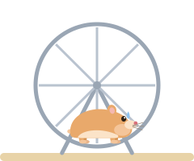
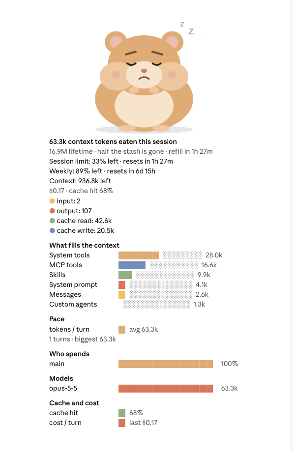

# 🐹 Token Hamster: Claude Code mod for token usage & limits

[](LICENSE)
[](https://github.com/anthropics/claude-code/tree/main/mods)
[](#install)


**Token Hamster is a [Claude Code mod](https://github.com/anthropics/claude-code/tree/main/mods), a plugin whose behaviour lives in a hooks module, that shows your token usage, your 5-hour and weekly plan limits, when they reset, and what each turn costs, live, inside Claude Code.** An animated hamster eats every token Claude eats, so you see your usage at a glance instead of running a separate command.

- **Token usage:** input, output, cache read and cache write tokens for the session, plus a lifetime total.
- **Usage limits:** the 5-hour session limit and the weekly limit as percent left, with a `refill in …` countdown to the reset.
- **Cost:** cost per turn and for the session, and cache hit rate.
- **Forecast:** your pace per turn and when the session limit will run out at that pace.
- **Statusline:** `🐹 all 3.9M · session 62% · week 95% · credits $1.99` under the prompt.

No API key, no log scraping, nothing estimated: the numbers come from Claude Code's own `usage` data at the end of every turn.

## How do I check my Claude Code usage?

Install the mod and keep coding. Token Hamster answers the usual questions without leaving the session:

| Question | Where you see it |
| --- | --- |
| How many tokens has this session used? | The hamster's cheeks, the pane's counts, the statusline |
| How close am I to the 5-hour limit? | `session 62%` in the statusline; the hamster's mood |
| How much of the weekly limit is left? | `week 95%` in the statusline; the pane's limit bars |
| When does my Claude limit reset? | `refill in …` on the cage and in the pane |
| When will I hit the limit at this pace? | The pane's pace forecast |
| What does a turn cost? Is the cache working? | The pane's cost per turn and cache hit rate |
| Which subagent, tool or model burns the most tokens? | The pane's breakdown |

## Features

The cage band sits above the prompt. While a turn runs the hamster eats; between turns it naps.

### Mood follows your rate limits

The hamster's mood follows the emptiest limit, the 5-hour session or the week:

| Eating | Napping | ≤ 50% left | ≤ 25% left | 0% left |
| --- | --- | --- | --- | --- |
|  |  |  |  |  |

At half the limit it frowns and sweats. With a quarter left it runs it off in its wheel. When the limit is used up it sleeps in its house and counts down to the reset.

### Usage dashboard pane

`/hamster` (or **Details**) opens a pane with the counts and where the tokens went:



- **Context:** what fills the context window, as `/context` lists it.
- **Pace and forecast:** tokens per turn and when the session limit runs out.
- **Who spends:** the main loop against each subagent type, tool calls and models.
- **Cache and cost:** cache hit rate and cost per turn.

### Built to be glanced at

- **Smooth vector animation.** On desktop, VS Code and mobile it's an animated SVG: seeds fly into its mouth, it chews, blinks, and breathes `z z z` when idle.
- **The food is your real token mix.** 🟡 input, 🟠 output, 🟢 cache read, 🔵 cache write, in your session's actual proportions.
- **The cheeks are the session.** They grow with the log of tokens eaten.
- **Terminal fallback.** In the terminal it's a colour pixel-art hamster in half blocks, with the same chewing and moods.
- **Subagents count too.** Subagent turns feed the hamster.

## Token Hamster vs other Claude Code usage tools

| | Token Hamster | ccusage | Usage monitor apps | Statusline scripts |
| --- | --- | --- | --- | --- |
| Runs inside Claude Code | ✅ mod / plugin | CLI you run | separate terminal / menu bar app | ✅ |
| Live 5-hour and weekly limits | ✅ | — | ✅ | some |
| Reset countdown and forecast | ✅ | — | ✅ | some |
| Cost per turn, cache hit rate | ✅ | ✅ (from logs) | ✅ | some |
| Breakdown by subagent, tool, model | ✅ | by model | — | — |
| Animated mascot | 🐹 | — | — | — |

Use ccusage for reports over past days and months; use Token Hamster to watch the current session as it happens. They work fine together.

## Requirements

- Claude Code 2.1.289 or later (the mods / plugin hooks API).
- Works in the terminal, the desktop app, VS Code and mobile.
- The limit bars and moods appear when Claude Code reports plan limits (Pro and Max subscriptions). With an API key you still get tokens and cost.

## Install

It installs like any Claude Code plugin. In Claude Code, run:

```
/plugin marketplace add valeryia-piatrova/token-hamster
```

```
/plugin install token-hamster@token-hamster
```

Or from your shell:

```bash
claude plugin marketplace add valeryia-piatrova/token-hamster
```

```bash
claude plugin install token-hamster@token-hamster
```

### From source

```bash
git clone https://github.com/valeryia-piatrova/token-hamster.git ~/mods/token-hamster
```

```bash
claude --plugin-dir ~/mods/token-hamster
```

For the desktop app, or anywhere you can't pass a flag, add the folder's path to `CLAUDE_CODE_PLUGIN_DIRS` in the `env` block of `~/.claude/settings.json`.

The cage band sits above the prompt. To open the pane, press **Details** (`d`) or type `/hamster`. Collapse the band with its `[-]`.

## How it works

Like the [mods that ship inside Claude Code](https://github.com/anthropics/claude-code/tree/main/mods) (`diff`, `agents-md`), Token Hamster is a plugin with a `.claude-plugin/plugin.json`, a `hooks/hooks.json` naming the module, and TypeScript hooks under `hooks/`.

Data comes from the `turn.complete` hook's `usage` field, the API's own token counts, so the counters move once a turn, when it ends. Limits and reset times come from the same event. The lifetime total is kept across sessions in the plugin store.

## Develop

```bash
claude plugin validate .
```

```bash
claude plugin test .
```

| File | What it is |
| --- | --- |
| `.claude-plugin/plugin.json` | manifest |
| `hooks/hooks.json` | points to the hooks module |
| `hooks/register.tsx` | the hooks: `session.start`, `command.run`, `tool.call`, `turn.start`, `turn.complete`, `ui.render` (band and pane) |
| `types/index.d.ts` | the `$.state` contract |
| `tests/hamster.test.tsx` | tests on the terminal and desktop surfaces |

Built on the official plugin-authoring API (function hooks). The API is early access and may change between releases.

## License

[MIT](LICENSE)
